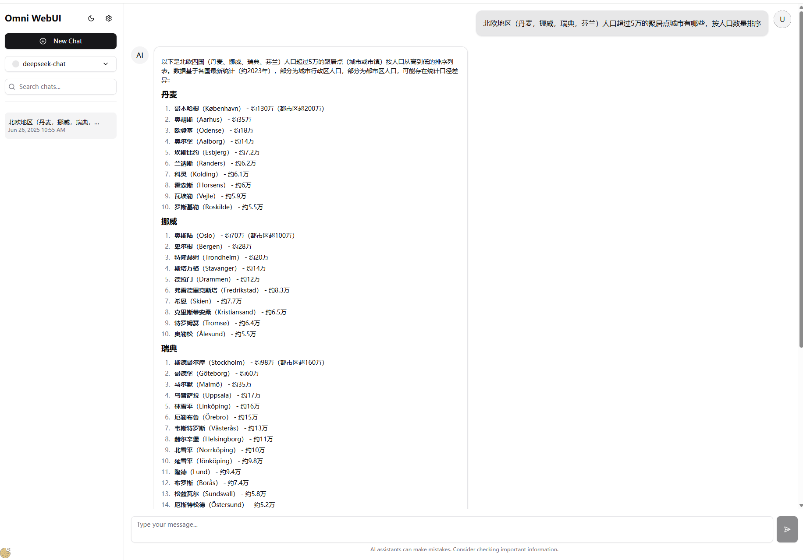

# Omni WebUI

A modern web interface for AI chat interactions built with React, Vite, and TypeScript.



## Features

- Modern React-based chat interface
- OpenAI API integration
- Syntax highlighting for code blocks
- Mathematical expressions support with MathJax
- Responsive design with Tailwind CSS
- TypeScript support

## Installation

### Prerequisites

- Node.js (version 18 or higher)
- npm, yarn, pnpm, or bun

### Environment Setup

Before running the application, you need to set up your environment variables. Create a `.env.local` file in the root directory and add the following:

```bash
OPENAI_API_KEY=your_openai_api_key_here
OPENAI_BASE_URL=https://api.openai.com/v1  # or https://api.deepseek.com if you're using DeepSeek or http://127.0.0.1:11434/v1 if you're using Ollama
```

**Important:**
- Replace `your_openai_api_key_here` with your actual OpenAI API key
- The `OPENAI_BASE_URL` can be customized if you're using a different OpenAI-compatible endpoint

### Getting Started

1. Clone the repository
2. Install dependencies:

```bash
npm install
# or
yarn install
# or
pnpm install
# or
bun install
```

3. Set up your environment variables (see Environment Setup above)

4. Run the development server:

```bash
npm run dev
# or
yarn dev
# or
pnpm dev
# or
bun dev
```

5. Open [http://localhost:5173](http://localhost:5173) with your browser to see the result.

## Available Scripts

- `npm run dev` - Start the development server
- `npm run build` - Build the project for production
- `npm run preview` - Preview the production build
- `npm run lint` - Run Biome linter
- `npm run test` - Run tests
- `npm run test:watch` - Run tests in watch mode
- `npm run test:coverage` - Run tests with coverage report

## Tech Stack

- **Frontend:** React 18, TypeScript
- **Build Tool:** Vite
- **Styling:** Tailwind CSS
- **UI Components:** Radix UI
- **AI Integration:** OpenAI API
- **Markdown:** React Markdown with syntax highlighting
- **Math Rendering:** MathJax
- **State Management:** Zustand
- **Testing:** Vitest, Testing Library
- **Code Quality:** Biome

## Development

The project uses modern development tools:

- **Vite** for fast development and building
- **TypeScript** for type safety
- **Biome** for linting and formatting
- **Vitest** for testing

You can start editing the application by modifying files in the `src` directory. The page auto-updates as you edit the files thanks to Vite's hot module replacement.
